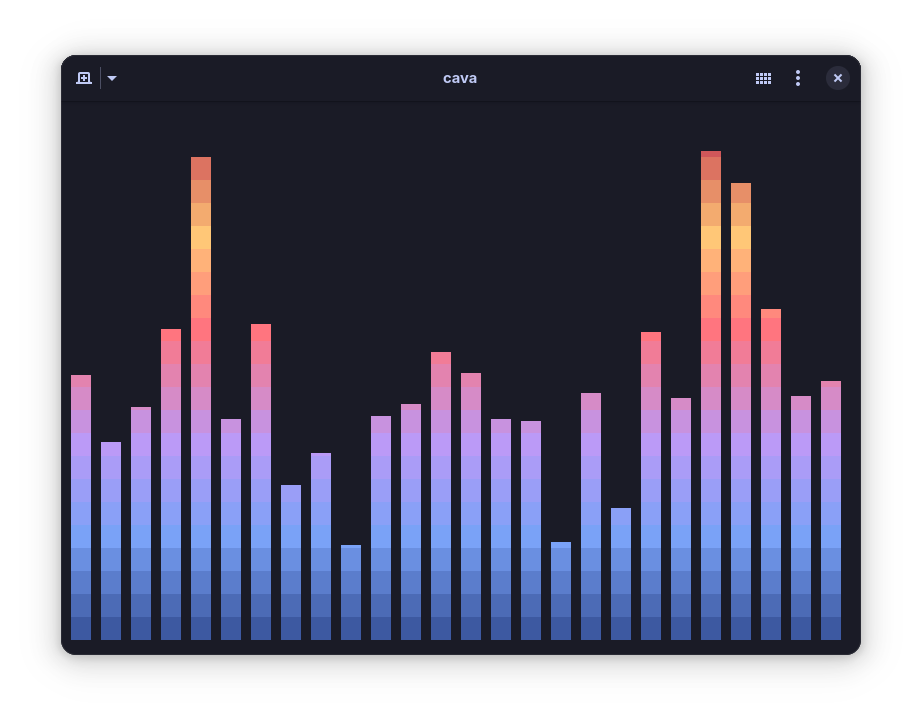

# Tokyonight theme for cava
This repo contains the [Tokyonight](https://github.com/folke/tokyonight.nvim) theme for cava!


## How do i apply this??
1. Open the theme you want from [themes](themes) and copy it's contents
2. Open in your system the file ```~/.config/cava/config``` with your favourite editor and go down to whwere it says ```[color]```
3. Delete the color section and ONLY THE COLOR SECTION (stop at smoothing)
4. Paste what you copied from step 1 and make sure you save before exiting
5. Enjoy!

## Help, the background is weird
If you are usign ur terminal with blur or anything you might see on cava a solid color background instead of being blurred with x opacity.
To fix this simply go to ```[color]``` and where it says ```background``` and add a ; in the beginning 

## Where do i find Moon, Storm and/or Day variant :(
so uhh, i haven't done them yet... you will have to wait a bit

## Misc
Obviously this theme takes inspiration from the tokyonight neovim theme and vscode theme, thus thanks to enkia (vscode) and folke (nvim) for this cool colorscheme theme thing.
About the other colours it is a small change I will do when I uh.. remember about it that isn't right before i go to sleep... Sorry :/
